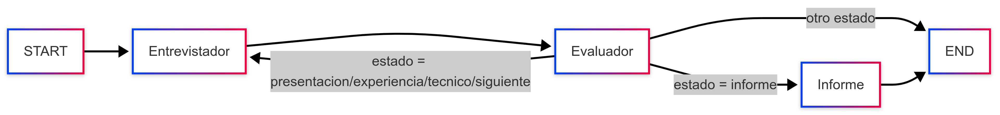

# Sistema de Entrevistas Automatizado con IA

## Descripción General
Este proyecto implementa un sistema avanzado de entrevistas automatizadas utilizando inteligencia artificial, específicamente diseñado para realizar entrevistas técnicas a desarrolladores. El sistema utiliza la API de Google Vertex AI y el modelo Gemini para proporcionar una experiencia de entrevista interactiva y dinámica.

## Componentes Principales

### 1. InterviewAgent (interview_agent.py)
Este es el componente central que maneja la lógica de la entrevista. Sus características principales incluyen:

#### Gestión de Estados
Implementa una máquina de estados que controla el flujo de la entrevista a través de diferentes fases:
- Presentación
- Experiencia
- Técnico
- Informe final

#### Sistema de Preguntas
- Cada estado contiene un conjunto predefinido de preguntas relevantes para esa fase de la entrevista.
- Evaluación de Respuestas: Incluye un sistema de evaluación que determina cuándo avanzar a la siguiente fase de la entrevista.

#### Generación de Informes
Al finalizar la entrevista, genera un informe detallado que incluye:
- Resumen del perfil
- Puntos fuertes
- Áreas de mejora
- Recomendación final

### 2. Sistema de Agentes (agent.py)
Este módulo gestiona la integración con los servicios de Google Cloud y configura las herramientas disponibles para el sistema:

#### Integración con Google Cloud:
- Configuración de credenciales
- Inicialización de Vertex AI
- Configuración del cliente Gemini

#### Herramientas de Entrevista:
- `developer_interview_python`: Maneja preguntas específicas sobre Python
- `developer_interview_company`: Proporciona información sobre la empresa
- `developer_interview_nervous`: Analiza el estado emocional del candidato

### 3. Servidor WebSocket (server.py)
Implementa la interfaz de comunicación en tiempo real:

#### Gestión de Conexiones
- Maneja conexiones WebSocket bidireccionales entre el cliente y el modelo Gemini.

#### Procesamiento de Mensajes:
- Recibe y procesa mensajes del cliente
- Gestiona las respuestas del modelo
- Maneja llamadas a herramientas específicas

#### Sistema de Retroalimentación
- Incluye endpoints para recopilar feedback sobre las entrevistas.

### 4. Plantillas del Sistema (templates.py)
Define las instrucciones y formatos para:

#### Formato de Documentos
- Estructura cómo se presentan los documentos y contextos.

#### Instrucciones del Sistema
Define el comportamiento del entrevistador virtual, incluyendo:
- Rol y objetivos
- Secuencia de la entrevista
- Reglas de interacción

## Características Técnicas Destacadas

### Integración con IA
- Utiliza el modelo Gemini 2.0 Flash
- Implementa embeddings para procesamiento de texto
- Sistema de vectores para recuperación de información

### Arquitectura del Sistema
- Implementación basada en grafos para el flujo de la entrevista
- Sistema de checkpoints para mantener el estado
- Manejo asíncrono de comunicaciones

### Seguridad y Logging
- Integración con Google Cloud Logging
- Manejo de errores y reintentos
- Sistema de feedback estructurado

## Flujo de la Entrevista

### Inicio:
- Inicialización del agente
- Establecimiento de conexión WebSocket

### Proceso de Entrevista:
- Fase de presentación
- Evaluación de experiencia
- Preguntas técnicas
- Análisis continuo del estado emocional

### Finalización:
- Generación de informe
- Recopilación de feedback
- Cierre de conexión

## Consideraciones Técnicas

### Requisitos del Sistema
- Python 3.x
- Google Cloud Platform
- FastAPI
- WebSockets
- Vertex AI

### Configuración
- Requiere credenciales de Google Cloud
- Variables de entorno para configuración
- Configuración de modelos y ubicación

### Escalabilidad
- Diseño modular para fácil extensión
- Soporte para múltiples sesiones simultáneas
- Sistema de reintentos para conexiones fallidas

## Uso y Mantenimiento
- Inicialización
- Procesamiento de Respuestas
- Reinicio de Entrevista

Este sistema proporciona una solución completa y sofisticada para automatizar el proceso de entrevistas técnicas, combinando tecnologías avanzadas de IA con una arquitectura robusta y escalable.

